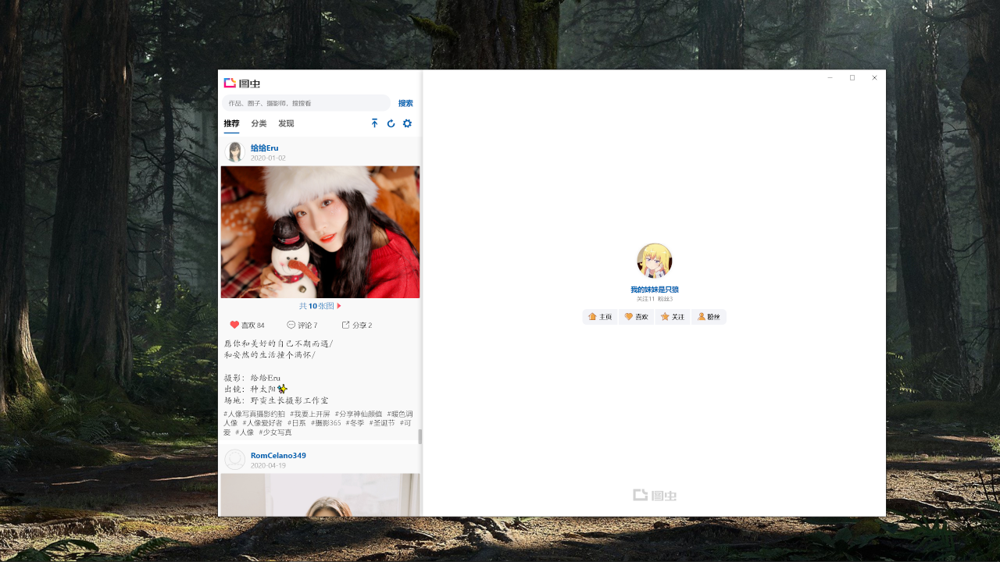
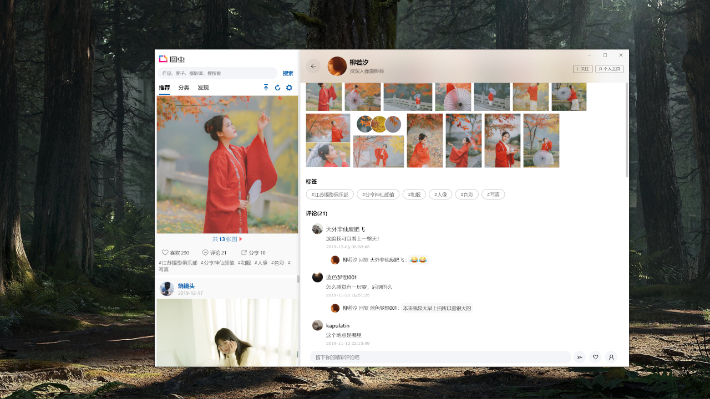
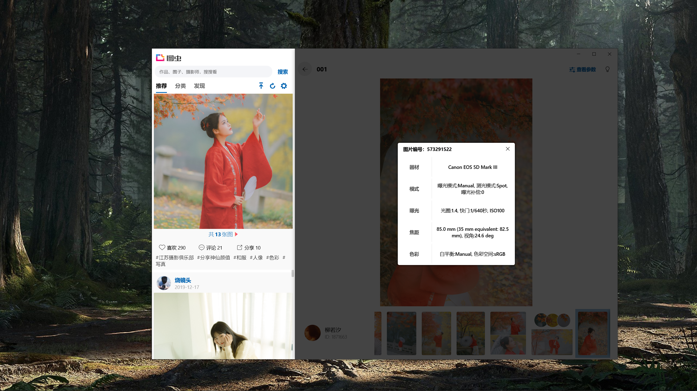
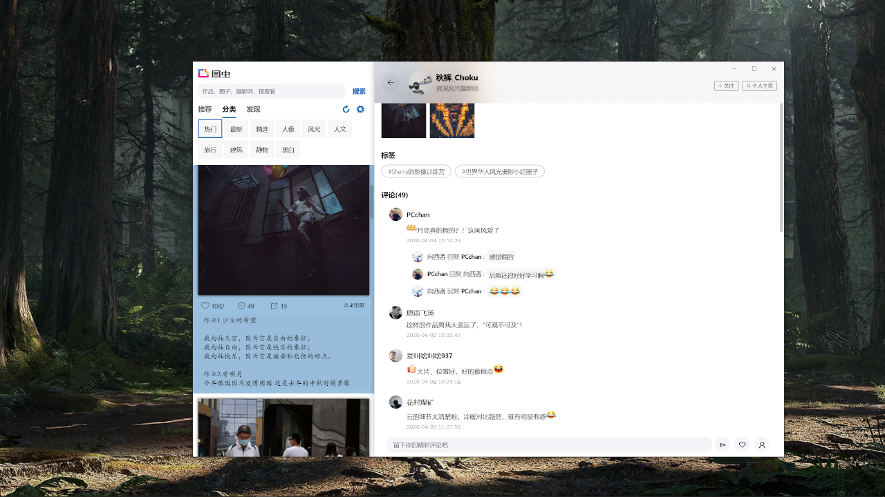
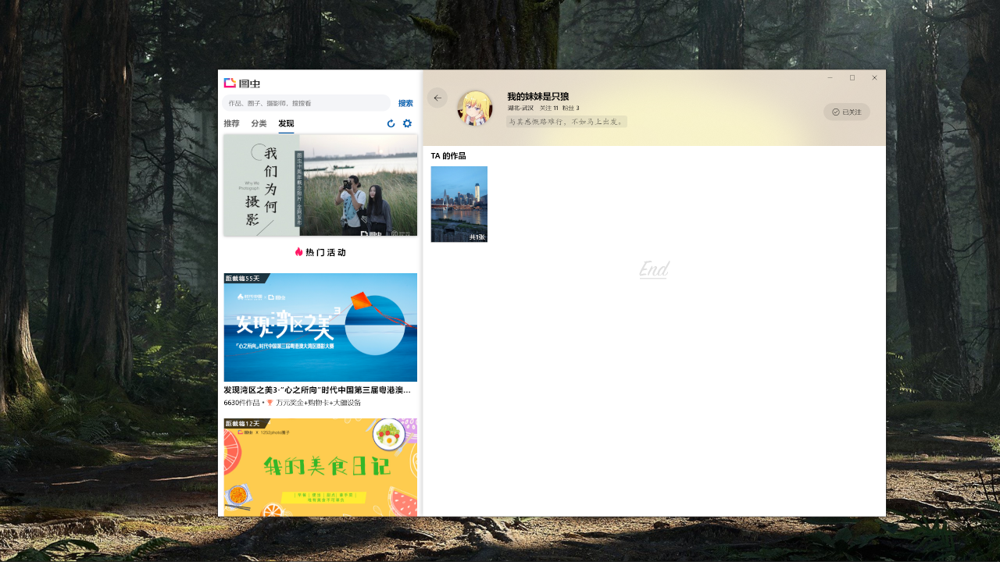

## <b>图虫 UWP 第三方应用</b>

### 应用简介

已经有超过500万的摄影爱好者入驻图虫，在这里，发现基于共同兴趣的同好，鼓励原创和分享精神。

------------------------------------------

这是一个第三方的应用程序，今后将慢慢改进，添砖加瓦，如果有任何建议或者侵犯了您的权益，烦请联系开发人员 yaoyiming123@live.com

现在就去 [Microsoft Store](https://www.microsoft.com/store/apps/9PLTN6HJWWKL) 下载体验

### 截图

#### 浏览优秀的作品

#### 欣赏图集和查看大家的评论

#### 查看照片的参数

#### 分类查看作品

#### 查看最近的活动

### 引用
| 名字 | 许可类型 | 项目网站 |
| --- | --- | --- |
| UWP Community Toolkit | [MIT License](https://github.com/Microsoft/UWPCommunityToolkit/blob/master/license.md) | [github.com/Microsoft/UWPCommunityToolkit ](https://github.com/Microsoft/UWPCommunityToolkit) |
| Microsoft.UI.Xaml | [MIT License](https://github.com/JamesNK/Newtonsoft.Json/blob/master/LICENSE.md) | [github.com/Microsoft/microsoft-ui-xaml](https://github.com/Microsoft/microsoft-ui-xaml) |
| Json.NET | [MIT License](https://github.com/JamesNK/Newtonsoft.Json/blob/master/LICENSE.md) | [newtonsoft.com](https://www.newtonsoft.com/json) |
| MaterialLibs | [MIT License](https://github.com/cnbluefire/MaterialLibs/blob/master/LICENSE) | [github.com/cnbluefire/MaterialLibs](https://github.com/cnbluefire/MaterialLibs) |

### 更新日志
##### 2020/4/13 更新：
* 现在可以关注你喜欢的摄影师啦，快去作品页或者主页去关注TA吧!

##### 2020/4/10 更新：
* 新增个人中心！快快登录然后去右侧查看您的作品、点赞和关注吧；
* 与此同时，搜索框搬家啦，劳烦抬眼向上看；
* 优化了图片查看器的一丝体验，新增图片未放大时鼠标滚轮翻页的操作；
* 使用了新的“推荐” API，如果出现问题请尝试登录后再看；
* 优化了部分代码，今后我会舒服一些；
* 修复了几个小 bug，根据守恒定律，可能在别处又产生了新的 bug，如果遇到请联系我反馈，谢谢！

##### 2020/3/8 更新：
* 现在支持发送一级评论

##### 2020/2/19 更新：
* 加入动态磁贴；
* 搜索功能上线；
* 完善评论区阅读体验；
* 图片查看页面增加缩放拖拽手势；
* 修复 bug

##### 2019/5/5 更新：
* 点击摄影师名字现在可以查看其其他作品了；
* 界面微调、bug修复

##### 2019/4/11 更新：
* 支持账号登录，分类查看，点赞和分享功能；
* UI 微调，提升了一丝体验

#
[去Microsoft Store下载](https://www.microsoft.com/store/apps/9PLTN6HJWWKL)

2019-2022 ShockJockey.
